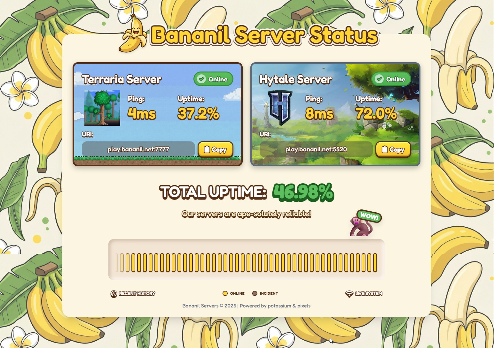

# Game Server Infrastructure & Status Dashboard

This repository contains the infrastructure code, monitoring tools, and web dashboard for the `bananil.net` game server network. The system runs on a Raspberry Pi 5, utilizing a hybrid network setup for secure web access and low-latency gaming.



## Project Structure

This is a Rust workspace containing several components:

### Web & Monitoring

* **`status-app/`**: A frontend web dashboard built with **Rust** and **Leptos** (WASM). It displays the real-time status of the game servers.
  * *Runs on:* Port `3000`
  * *Public URL:* `https://bananil.net`
* **`status-monitor/`**: A backend service that periodically checks the health of the configured game servers and updates the status.

### Health Checkers

Standalone Rust binaries designed to probe specific game protocols:

* **`terraria-health-checker/`**: Probes Terraria servers (TCP/7777).
* **`hytale-health-checker/`**: Probes Hytale servers.

### Server Configurations

* **`terraria-server/`**: Docker Compose and configuration files for the Terraria server instance.
* **`hytale-server/`**: Configuration for the Hytale server.

---

## Infrastructure Documentation: Hybrid Cloudflare Tunnel & Direct DDNS

**Target System:** Raspberry Pi 5 (Debian/Bookworm)
**Domain:** `bananil.net`
**DDNS Host:** `<your-domain>.tplinkdns.com` (Managed by Deco Router)

### Architecture Overview

1. **Web Traffic (`https://bananil.net`)**
    * **Path:** User -> Cloudflare Edge (Proxy/SSL) -> Tunnel (encrypted) -> Raspberry Pi (`localhost:3000`).
    * **Ports:** 80/443 (handled by Cloudflare).
    * **Status:** Secure, IP Hidden.

2. **Game Traffic (`play.bananil.net`)**
    * **Path:** User -> Cloudflare DNS (No Proxy) -> Deco Router (`<your-domain>.tplinkdns.com`) -> Port Forwarding -> Raspberry Pi (`7777`, `5520`).
    * **Ports:** 7777 (Game), 5520 (Admin).
    * **Status:** Direct connection, Low Latency, IP Exposed.

---

### Part 1: The Web Tunnel (Cloudflare)

*Handles the website and API traffic securely.*

#### 1. Clean Installation

Remove any conflicting configurations and install the latest `cloudflared`.

```bash
# Remove old instances
sudo systemctl stop cloudflared 2>/dev/null
sudo cloudflared service uninstall 2>/dev/null
sudo rm -rf /etc/cloudflared

# Add Repository (Bookworm)
curl -fsSL https://pkg.cloudflare.com/cloudflare-main.gpg | sudo tee /usr/share/keyrings/cloudflare-main.gpg >/dev/null
echo "deb [signed-by=/usr/share/keyrings/cloudflare-main.gpg] https://pkg.cloudflare.com/cloudflared bookworm main" | sudo tee /etc/apt/sources.list.d/cloudflared.list

# Install
sudo apt update && sudo apt install cloudflared -y
```

#### 2. Authentication & Creation

Login and create the specific tunnel identity.

```bash
# Login (Opens browser URL)
cloudflared tunnel login

# Create Tunnel (Name: "rasp-hybrid")
cloudflared tunnel create rasp-hybrid
```

* **Action:** Copy the **Tunnel UUID** from the output (e.g., `a1b2c3d4-....`).

#### 3. Configuration File

Create the system configuration.

```bash
# Prepare directory
sudo mkdir -p /etc/cloudflared
sudo cp ~/.cloudflared/*.json /etc/cloudflared/

# Create Config
sudo nano /etc/cloudflared/config.yml
```

**Paste the following content (Insert your UUID):**

```yaml
tunnel: <INSERT_YOUR_UUID_HERE>
credentials-file: /etc/cloudflared/<INSERT_YOUR_UUID_HERE>.json

ingress:
  # Main Website
  - hostname: bananil.net
    service: http://localhost:3000

  # Catch-all (Required)
  - service: http_status:404
```

#### 4. Route DNS & Start Service

Link the domain to the tunnel and enable the background service.

```bash
# Route DNS (This creates the CNAME for bananil.net)
cloudflared tunnel route dns rasp-hybrid bananil.net

# Install as system service
sudo cloudflared service install
sudo systemctl start cloudflared
sudo systemctl enable cloudflared
```

---

### Part 2: The Game Subdomain (Direct DNS)

*Handles game connections via your Deco Router.*

#### 1. Verify Router DDNS

Ensure your Deco Router has DDNS active.

* **Check:** Open Deco App -> Advanced -> DDNS.
* **Active Domain:** `<your-domain>.tplinkdns.com`

#### 2. Create Cloudflare CNAME

This points `play.bananil.net` to your router.

1. Log in to **Cloudflare Dashboard** > **DNS**.
2. Click **Add Record**.
    * **Type:** `CNAME`
    * **Name:** `play`
    * **Target:** `<your-domain>.tplinkdns.com`
    * **Proxy Status:** **DNS Only (Grey Cloud)** ⚠️ *CRITICAL*
    * **TTL:** Auto
3. Click **Save**.

---

### Part 3: Router Port Forwarding

*Allows traffic from the internet to reach the Pi.*

Open **Deco App** > **Advanced** > **NAT Forwarding** > **Port Forwarding**.

| Service Name | External Port | Internal IP           | Internal Port | Protocol      |
| :----------- | :------------ | :-------------------- | :------------ | :------------ |
| **Terraria** | `7777`        | `192.168.x.x` (Pi IP) | `7777`        | **TCP & UDP** |
| **Admin**    | `5520`        | `192.168.x.x` (Pi IP) | `5520`        | **TCP**       |

---

### Part 4: Verification Checklist

1. **Test Web (HTTPS):**
    * Visit `https://bananil.net` in a browser.
    * **Success:** Loads your app (Port 3000) with a secure lock.

2. **Test Game (Direct):**
    * Open a terminal on your computer (not the Pi).
    * Run: `ping play.bananil.net`
    * **Success:** It should resolve to your **Public Home IP** (check `curl ifconfig.me` on Pi to compare).

3. **Test Connection:**
    * Connect Terraria to: `play.bananil.net` Port `7777`.
    * **Success:** You enter the game.

## Development

### Requirements

* Rust (latest stable)
* `trunk` (for web frontend): `cargo install trunk`
* Docker & Docker Compose

### Building

To build the frontend application:

```bash
cd status-app
trunk build --release
```

To run the full stack locally (assuming configuration is set):

```bash
cargo run -p status-monitor
cd status-app && trunk serve
```
